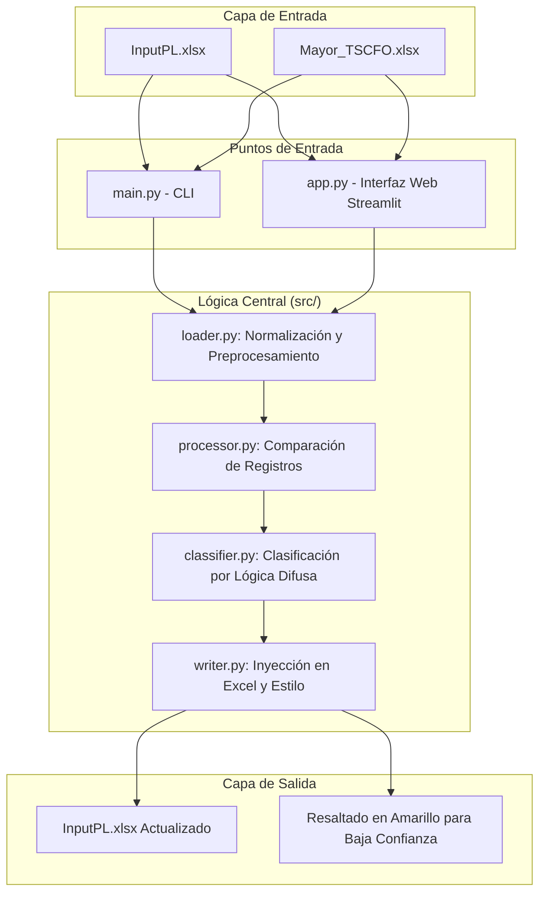

# StartupCFO Tool: Automatización de Conciliación Contable

Este proyecto resuelve un desafío real de contabilidad para **The Startup CFO**: la automatización de la conciliación y clasificación de informes de gastos mensuales. Conecta los datos brutos de las exportaciones contables (**Mayor**) con los informes históricos estructurados (**InputPL**).

## 🏢 Visión General del Proyecto

La herramienta automatiza la detección de registros contables faltantes y utiliza **Lógica Difusa (Fuzzy Logic)** basada en IA para sugerir categorías de gastos, reduciendo significativamente el esfuerzo manual mientras se mantiene la alta calidad en los formatos de los informes.

### 📋 Requisitos Técnicos Clave
- **Python**: 3.11+
- **Formatos de Entrada**: Microsoft Excel (.xlsx)
- **Lógica Principal**: Comparación de registros basada en identificadores únicos compuestos y similitud de texto para la clasificación.

---

## 🏗️ Arquitectura del Sistema

El siguiente diagrama ilustra el flujo de datos a través de la arquitectura modular de la aplicación:



---

## 🛠️ Stack Tecnológico

- **Pandas**: Manipulación y comparación de datos centralizada.
- **Streamlit**: Interfaz web moderna para un procesamiento de "un solo clic".
- **TheFuzz**: Coincidencia difusa de texto para la sugerencia de categorías de gastos.
- **Openpyxl**: Manipulación de Excel a bajo nivel para preservar los estilos y diseños originales del documento.

---

## 📂 Estructura del Proyecto

```text
StartupCFO_prueba_tecnica/
├── app.py              # Punto de entrada de la aplicación Web Streamlit
├── main.py             # Punto de entrada de la CLI (Terminal)
├── requirements.txt    # Dependencias del proyecto
├── src/
│   ├── classifier.py   # Lógica de clasificación por IA (Fuzzy Logic)
│   ├── config.py       # Configuraciones globales y mapeos
│   ├── loader.py       # Carga de datos y normalización (Ruta/Buffer)
│   ├── processor.py    # Comparación y detección de diferencias
│   └── writer.py       # Formato de Excel e inyección de datos
├── data/
│   ├── raw/            # Archivos Excel de origen
│   └── output/         # Resultados generados (CLI)
└── tests/              # Suite de pruebas unitarias
```

---

## ⚙️ Detalles de la Lógica

### 1. Identificación Robusta de Registros
El sistema compara los registros utilizando una clave compuesta: `[Nº Asiento, Fecha, Saldo]`. Esto asegura que incluso si las descripciones cambian ligeramente, la misma transacción no se duplica si ya existe en el histórico.

### 2. Categorización Inteligente
Los nuevos registros se analizan comparándolos con los datos históricos. Si no se encuentra una coincidencia exacta para un "Concepto", el sistema utiliza el algoritmo `token_set_ratio` para encontrar la coincidencia más cercana.
- **Confianza > 80%**: Asignación automática.
- **Confianza < 80%**: Se asigna pero se resalta en **amarillo** en el Excel final para su verificación manual.

### 3. Inyección Inteligente en Excel
A diferencia de las exportaciones estándar en CSV, esta herramienta:
- Localiza el marcador `END` en la hoja de Excel.
- Inserta las nuevas filas *por encima* del marcador para preservar las notas finales del documento.
- Replica el formato de las celdas (fechas, formatos numéricos).

---

## 🚀 Primeros Pasos

### Instalación

```bash
# Instalar las dependencias necesarias
pip install -r requirements.txt
```

### Uso

#### Opción A: Interfaz Web 
Ideal para una experiencia sencilla de "un solo clic".
```bash
streamlit run app.py
```

#### Opción B: Terminal (CLI)
Ideal para procesamiento local y scripts de automatización.
```bash
python3 main.py
```
