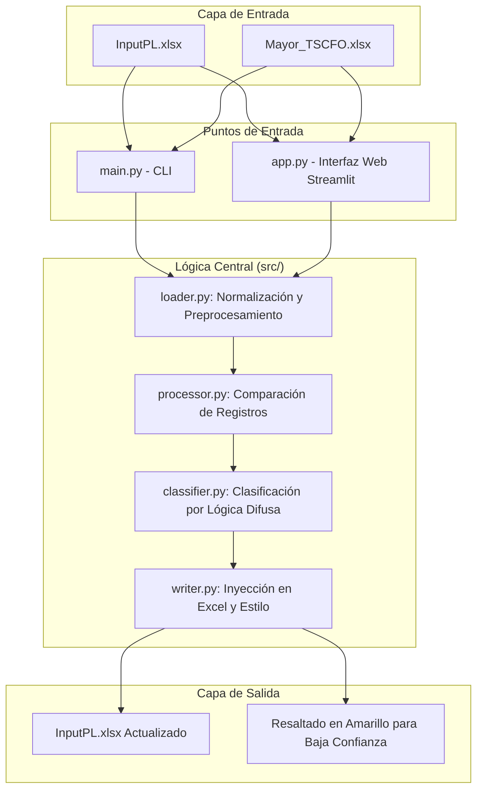

# StartupCFO Tool: Automatización de Conciliación Contable

Este proyecto resuelve un desafío real de contabilidad para **The Startup CFO**: la automatización de la conciliación y clasificación de informes de gastos mensuales. Conecta los datos brutos de las exportaciones contables (**Mayor**) con los informes históricos estructurados (**InputPL**).

## 🏢 Visión General del Proyecto

La herramienta automatiza la detección de registros contables faltantes y utiliza **Lógica Difusa (Fuzzy Logic)** mediante coincidencia de texto para sugerir categorías de gastos, reduciendo significativamente el esfuerzo manual mientras se mantiene la alta calidad en los formatos de los informes.

### 📋 Requisitos Técnicos Clave
- **Python**: 3.11+
- **Formatos de Entrada**: Microsoft Excel (.xlsx)
- **Lógica Principal**: Comparación de registros basada en identificadores únicos compuestos y similitud de texto para la clasificación.

---

## 🏗️ Arquitectura del Sistema

El siguiente diagrama ilustra el flujo de datos a través de la arquitectura modular de la aplicación:



---

## 🛠️ Stack Tecnológico

- **Pandas**: Manipulación y comparación de datos centralizada.
- **Streamlit**: Interfaz web moderna para un procesamiento de "un solo clic".
- **TheFuzz**: Coincidencia difusa de texto para la sugerencia de categorías de gastos.
- **Openpyxl**: Manipulación de Excel a bajo nivel para preservar los estilos y diseños originales del documento.
- **Pytest**: Framework de testing para pruebas unitarias y cobertura de código.
- **Rich**: Librería para mejorar la presentación en terminal con colores y formato avanzado.

---

## 📂 Estructura del Proyecto

```text
StartupCFO_prueba_tecnica/
├── app.py              # Punto de entrada de la aplicación Web Streamlit
├── main.py             # Punto de entrada de la CLI (Terminal)
├── requirements.txt    # Dependencias del proyecto
├── src/
│   ├── classifier.py   # Lógica de clasificación por Fuzzy Logic (coincidencia de texto)
│   ├── config.py       # Configuraciones globales y mapeos
│   ├── loader.py       # Carga de datos y normalización (Ruta/Buffer)
│   ├── logger.py       # Sistema de logging con colores para terminal
│   ├── processor.py    # Comparación y detección de diferencias
│   └── writer.py       # Formato de Excel e inyección de datos
├── data/
│   ├── raw/            # Archivos Excel de origen
│   └── output/         # Resultados generados (CLI)
└── tests/              # Suite de pruebas unitarias
```

---

## ⚙️ Detalles de la Lógica

### 1. Identificación Robusta de Registros
El sistema compara los registros utilizando una clave compuesta: `[Nº Asiento, Fecha, Saldo]`. Esto asegura que incluso si las descripciones cambian ligeramente, la misma transacción no se duplica si ya existe en el histórico.

### 2. Categorización Inteligente
Los nuevos registros se analizan comparándolos con los datos históricos. Si no se encuentra una coincidencia exacta para un "Concepto", el sistema utiliza **Fuzzy String Matching** (algoritmo `token_set_ratio` de la librería TheFuzz) para encontrar la coincidencia más cercana basada en similitud de texto.

**Niveles de Confianza:**
- **Confianza = 100%**: Coincidencia exacta encontrada en el histórico.
- **Confianza ≥ 70%**: Asignación automática basada en similitud alta.
- **Confianza < 70%**: Se marca como **"NEW - NEEDS REVIEW"** y requiere revisión manual.

**¿Qué significa "NEW - NEEDS REVIEW"?**
Esta etiqueta se asigna cuando el sistema no puede clasificar automáticamente un gasto con suficiente confianza. Ocurre en dos casos:
1. **No hay histórico de referencia**: El sistema no tiene datos previos para comparar.
2. **Similitud baja**: El concepto nuevo no se parece lo suficiente (menos del 70%) a ningún concepto del histórico.

**¿Por qué hay que revisarlos?**
- El sistema no puede garantizar la categoría correcta con confianza.
- Pueden ser nuevos tipos de gasto que no existen en el histórico.
- Pueden requerir conocimiento del negocio que el sistema no tiene.
- Una vez clasificados manualmente, pasan a formar parte del histórico y ayudan a clasificar futuros registros similares.

**Indicadores Visuales:**
- **Confianza < 80%**: Se resalta en **amarillo** en el Excel final para su verificación manual.
- **"NEW - NEEDS REVIEW"**: Requiere revisión y clasificación manual obligatoria.

### 3. Inyección Inteligente en Excel
A diferencia de las exportaciones estándar en CSV, esta herramienta:
- Localiza el marcador `END` en la hoja de Excel (usa la primera fila END encontrada como punto de inserción).
- Inserta las nuevas filas *por encima* del marcador para preservar las notas finales del documento.
- **Limpieza de múltiples filas END**: Si el archivo contiene múltiples filas END (intermedias y finales), el sistema elimina automáticamente las intermedias, dejando solo una fila END al final del documento.
- Replica el formato de las celdas (fechas, formatos numéricos).
- Reescribe las filas existentes desde el DataFrame normalizado para corregir valores corruptos (como "dic/99" en la columna Mes).

---

## 🚀 Primeros Pasos

### Instalación

```bash
# Instalar las dependencias necesarias
pip install -r requirements.txt
```

### Uso

#### Opción A: Interfaz Web 
Ideal para una experiencia sencilla de "un solo clic".
```bash
streamlit run app.py
```

#### Opción B: Terminal (CLI)
Ideal para procesamiento local y scripts de automatización.

**Requisitos previos:**
- Los archivos `InputPL.xlsx` y `Mayor_TSCFO.xlsx` deben estar en `data/raw/`
- O modificar las rutas en `src/config.py` según tu estructura

**Ejecución:**
```bash
python3 main.py
```

**Flujo interactivo:**
1. El sistema carga y normaliza los datos
2. Muestra avisos de calidad de datos en la consola
3. Si detecta duplicados exactos, pregunta: `¿Desea eliminar duplicados exactos automáticamente? (s/n):`
4. Responde `s` para eliminar o `n` para continuar sin limpiar
5. El proceso continúa con la comparación y clasificación
6. Genera el archivo actualizado en `data/output/InputPL_Updated.xlsx`

---

## 🛡️ Robustez y Validación de Errores

El proyecto incluye mecanismos para garantizar la integridad de los datos y facilitar la depuración por parte del usuario.

### Validación de Estructura (Pre-vuelo)
Antes de procesar los datos, el sistema verifica que los archivos cargados contengan todas las columnas requeridas definidas en la configuración. Si falta alguna columna, el proceso se detiene de forma segura.

- **En la Web**: Se muestra una alerta roja indicando las columnas faltantes.
- **En la Terminal**: Se lanza un `ValueError` con el detalle del error de estructura.

### Auditoría de Calidad de Datos
El sistema realiza una auditoría automática de calidad de datos antes del procesamiento, detectando posibles problemas que podrían afectar la integridad del informe final. **El proceso continúa** incluso si se detectan estos problemas, pero se recomienda revisarlos.

**Problemas Detectados:**

1. **Valores Negativos en Debe/Haber**
   - Detecta valores negativos en las columnas `Debe` o `Haber`.
   - Indica las filas aproximadas donde se encuentran.
   - **Ejemplo**: `[InputPL] Detectados 3 valores negativos en la columna 'Debe' (Filas Excel aprox: [5, 6, 115]...).`

2. **Celdas Vacías en Columnas Críticas**
   - Detecta celdas vacías en columnas críticas: `Concepto`, `Nº Asiento`, `Fecha`.
   - Excluye automáticamente la fila `END` (marcador de fin de datos).
   - **Ejemplo**: `[InputPL] Detectadas 1 celdas vacías en la columna crítica 'Fecha' (Filas Excel aprox: [201]...).`

3. **Duplicados Exactos**
   - Detecta registros con el mismo `Nº Asiento`, `Fecha` y `Saldo` (identificadores únicos).
   - Indica cuántos grupos de duplicados se encontraron y el total de filas afectadas.
   - **Ejemplo**: `[InputPL] Detectados 2 grupos de duplicados exactos (mismo Nº Asiento, Fecha y Saldo) con un total de 5 filas afectadas (Filas Excel aprox: [45, 46, 78]...).`
   - **Archivo de Prueba**: `data/raw/InputPL_duplicate.xlsx` contiene ejemplos de duplicados para probar esta funcionalidad.
   - **Limpieza Interactiva**: Si se detectan duplicados, el sistema ofrece la opción de eliminarlos automáticamente:
     - **En la Web**: Checkbox "Eliminar duplicados exactos automáticamente"
     - **En la Terminal**: Pregunta interactiva `¿Desea eliminar duplicados exactos automáticamente? (s/n):`
     - Se mantiene solo la primera ocurrencia de cada grupo de duplicados
     - Los duplicados eliminados no aparecerán en el Excel final

4. **Inconsistencias en Saldos**
   - Detecta registros con el mismo `Nº Asiento` y `Fecha` pero diferente `Saldo`.
   - Puede indicar duplicados con errores o inconsistencias en los datos.
   - **Ejemplo**: `[Mayor] Detectadas 2 posibles inconsistencias: Registros con mismo Nº Asiento y Fecha pero diferente Saldo.`

**Visualización:**
- **En la Web**: Los avisos se muestran en un expandible "Avisos de Calidad de Datos" antes del procesamiento.
- **En la Terminal**: Los avisos se imprimen en la consola como advertencias.

### Archivos de Prueba

#### `InputPL_error.xlsx`
Se ha incluido el archivo `data/raw/InputPL_error.xlsx` específicamente para demostrar la validación de estructura. 
- **Estado**: A este archivo se le ha eliminado deliberadamente la columna `Concepto`.
- **Propósito**: Al intentar cargarlo, el sistema mostrará el error de validación, confirmando que la herramienta protege contra archivos mal formados que podrían corromper el informe final.

#### `InputPL_duplicate.xlsx`
Se ha incluido el archivo `data/raw/InputPL_duplicate.xlsx` para demostrar la detección de duplicados exactos.
- **Estado**: Este archivo contiene registros duplicados intencionalmente (mismo `Nº Asiento`, `Fecha` y `Saldo`).
- **Propósito**: Al procesarlo, el sistema detectará y reportará los duplicados en los avisos de calidad de datos, permitiendo verificar que la funcionalidad de detección funciona correctamente.

### Normalización y Preservación de Formatos
El sistema implementa mecanismos avanzados para garantizar la integridad de los formatos en Excel, especialmente en la columna `Mes`:

- **Normalización Inteligente de Fechas**: Si la columna `Mes` está vacía o contiene valores inválidos, el sistema deriva automáticamente el valor desde la columna `Fecha` (formato: `ene/25`, `feb/25`, etc.).
- **Prevención de Corrupción de Datos**: Al escribir en Excel, la columna `Mes` se formatea explícitamente como texto (`@`) para evitar que Excel interprete valores como `abr/25` como fechas, lo que podría corromperlos a valores incorrectos como `dic/99`.
- **Reescritura de Filas Existentes**: Las filas existentes en el Excel se reescriben desde el DataFrame normalizado para corregir cualquier valor corrupto que pudiera existir previamente, asegurando que todo el documento mantenga formatos consistentes.

---

## 🧪 Testing

El proyecto incluye una suite completa de **29 tests unitarios** que cubren las funcionalidades principales del sistema.

### Ejecutar Tests

```bash
# Ejecutar todos los tests
pytest tests/ -v

# Ejecutar un archivo específico
pytest tests/test_loader.py -v

# Ejecutar con cobertura de código
pytest tests/ --cov=src --cov-report=html
```

### Cobertura de Tests

Los tests cubren:

- ✅ **Normalización de datos**: Formateo de fechas, derivación de Mes desde Fecha, redondeo numérico
- ✅ **Validación de columnas**: Detección de columnas faltantes, manejo de END rows
- ✅ **Auditoría de calidad**: Detección de valores negativos, celdas vacías, duplicados exactos
- ✅ **Eliminación de duplicados**: Preservación de END rows, mantenimiento de primera ocurrencia
- ✅ **Comparación de registros**: Detección de registros faltantes, filtrado de END rows, uso de identificadores únicos
- ✅ **Manejo de edge cases**: DataFrames vacíos, valores None, columnas faltantes

### Estructura de Tests

```
tests/
├── __init__.py           # Paquete de tests
├── conftest.py           # Fixtures compartidas (7 fixtures)
├── test_loader.py        # Tests de carga y normalización (8 tests)
├── test_validator.py     # Tests de validación y limpieza (11 tests)
├── test_processor.py     # Tests de procesamiento (7 tests)
└── README.md             # Documentación detallada de los tests
```

Para más información sobre los tests, consulta [`tests/README.md`](tests/README.md).

---

## 📝 Sistema de Logging

El proyecto incluye un sistema de logging estructurado con salida coloreada para mejorar la experiencia de usuario en la terminal.

### Características

- **Colores por nivel de log**: 
  - 🔵 **INFO**: Mensajes informativos (azul)
  - 🟢 **SUCCESS**: Operaciones exitosas (verde)
  - 🟡 **WARNING**: Advertencias (amarillo)
  - 🔴 **ERROR**: Errores críticos (rojo)
  - 🔵 **DEBUG**: Información de depuración (cyan)

- **Integración con Rich**: Si la librería `rich` está instalada, el sistema utiliza formateo avanzado con:
  - Timestamps formateados
  - Tracebacks mejorados
  - Markup support
  - Mejor presentación visual

- **Fallback automático**: Si `rich` no está disponible, el sistema utiliza colores ANSI básicos para mantener la funcionalidad.

### Uso en el Código

```python
from src.logger import get_logger

logger = get_logger(__name__)

logger.info("Mensaje informativo")
logger.success("Operación completada exitosamente")
logger.warning("Advertencia: datos potencialmente problemáticos")
logger.error("Error crítico en el proceso")
```

### Visualización en Terminal

Cuando ejecutas `python main.py`, verás mensajes formateados con colores que facilitan la identificación rápida del tipo de información:

```
[INFO] Reading file from path: data/raw/InputPL.xlsx
[SUCCESS] Loaded 150 rows
[INFO] Comparing records using identifiers: ['Nº Asiento', 'Fecha', 'Saldo']
[SUCCESS] Comparison finished. Found 25 new records.
```

### Configuración

El sistema de logging se configura automáticamente al importar `get_logger`. Para personalizar el nivel de logging o desactivar Rich, puedes usar `setup_logger` directamente:

```python
from src.logger import setup_logger
import logging

logger = setup_logger("MiLogger", level=logging.DEBUG, use_rich=False)
```

---

## 🌐 Deployment

La aplicación está desplegada en **Render** y disponible en:

🔗 **[https://startupcfo-prueba-tecnica.onrender.com](https://startupcfo-prueba-tecnica.onrender.com)**

### Configuración de Deployment

El proyecto incluye un archivo `render.yaml` que configura automáticamente el despliegue en Render:

- **Build Command**: `pip install -r requirements.txt`
- **Start Command**: `streamlit run app.py --server.port $PORT --server.address 0.0.0.0`
- **Plan**: Free tier

### Notas Importantes

- **Almacenamiento**: En el plan gratuito, los archivos subidos se procesan en memoria y no se guardan permanentemente.
- **Auto-deploy**: Los cambios en la rama `develop` se despliegan automáticamente.
- **Disponibilidad**: El servicio puede tardar unos segundos en iniciar si ha estado inactivo (plan gratuito).

---

## 🔮 Mejoras Futuras

A continuación se listan posibles mejoras que podrían implementarse en el futuro:

### Mejoras Técnicas

1. **Sistema de aprendizaje incremental**
   - Guardar las clasificaciones manuales del usuario para mejorar la base de conocimiento
   - Implementar un sistema de feedback que aprenda de las correcciones

2. **Mejora del algoritmo de clasificación**
   - Experimentar con embeddings de texto (Word2Vec, FastText) para mejor comprensión semántica
   - Implementar un modelo de Machine Learning simple (Naive Bayes o SVM) entrenado con el histórico para clasificación automática

3. **Detección de duplicados avanzada**
   - Implementar detección de duplicados "casi exactos" (mismo concepto pero fechas ligeramente diferentes)
   - Usar técnicas de similitud de texto para encontrar registros similares

4. **Exportación de resultados**
   - Añadir opción para exportar solo los nuevos registros en CSV
   - Generar reportes estadísticos por tipo de gasto

### Mejoras de UX

1. **Edición en línea**
   - Permitir editar directamente "NEW - NEEDS REVIEW" desde la interfaz web
   - Guardar correcciones para mejorar futuras clasificaciones

2. **Filtros y búsqueda**
   - Añadir filtros por tipo de gasto, rango de fechas, nivel de confianza
   - Búsqueda de conceptos específicos

3. **Visualizaciones**
   - Gráficos de distribución de gastos por categoría
   - Dashboard con estadísticas resumidas

### Mejoras de Robustez

1. **Validación avanzada**
   - Detección de importes anormales (valores muy altos o muy bajos)
   - Validación de rangos de fechas (alertar fechas fuera del período esperado)

2. **Manejo de errores mejorado**
   - Logging estructurado a archivo
   - Notificaciones por email en caso de errores críticos

3. **Tests adicionales**
   - Tests de integración end-to-end
   - Tests de rendimiento para archivos grandes

### Mejoras de Infraestructura

1. **Almacenamiento persistente**
   - Integración con AWS S3 o Google Cloud Storage para guardar archivos
   - Base de datos para historial de clasificaciones

2. **API REST**
   - Exponer funcionalidades como API para integración con otros sistemas
   - Endpoints para clasificación y validación

3. **Autenticación y multi-usuario**
   - Sistema de usuarios para diferentes clientes
   - Historial de cambios y auditoría

---

**Nota**: Estas mejoras son sugerencias para futuras iteraciones. La solución actual es funcional y completa para el caso de uso descrito en el briefing.

---

## 📋 Gestión del Proyecto

Este proyecto fue organizado y gestionado utilizando **Trello** para el seguimiento de tareas y funcionalidades:

🔗 **[Tablero de Trello - The Startup CFO](https://trello.com/b/1zPDz7l9/thestartupcfo)**

El tablero incluye la planificación de tareas, seguimiento de features implementadas, y organización del trabajo durante el desarrollo del proyecto.
