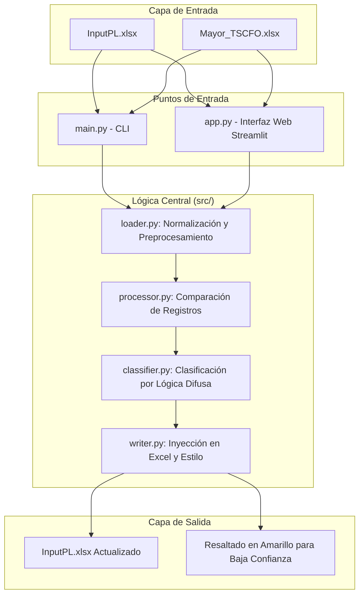

# StartupCFO Tool: Automatización de Conciliación Contable

Este proyecto resuelve un desafío real de contabilidad para **The Startup CFO**: la automatización de la conciliación y clasificación de informes de gastos mensuales. Conecta los datos brutos de las exportaciones contables (**Mayor**) con los informes históricos estructurados (**InputPL**).

## 🏢 Visión General del Proyecto

La herramienta automatiza la detección de registros contables faltantes y utiliza **Lógica Difusa (Fuzzy Logic)** basada en IA para sugerir categorías de gastos, reduciendo significativamente el esfuerzo manual mientras se mantiene la alta calidad en los formatos de los informes.

### 📋 Requisitos Técnicos Clave
- **Python**: 3.11+
- **Formatos de Entrada**: Microsoft Excel (.xlsx)
- **Lógica Principal**: Comparación de registros basada en identificadores únicos compuestos y similitud de texto para la clasificación.

---

## 🏗️ Arquitectura del Sistema

El siguiente diagrama ilustra el flujo de datos a través de la arquitectura modular de la aplicación:



---

## 🛠️ Stack Tecnológico

- **Pandas**: Manipulación y comparación de datos centralizada.
- **Streamlit**: Interfaz web moderna para un procesamiento de "un solo clic".
- **TheFuzz**: Coincidencia difusa de texto para la sugerencia de categorías de gastos.
- **Openpyxl**: Manipulación de Excel a bajo nivel para preservar los estilos y diseños originales del documento.

---

## 📂 Estructura del Proyecto

```text
StartupCFO_prueba_tecnica/
├── app.py              # Punto de entrada de la aplicación Web Streamlit
├── main.py             # Punto de entrada de la CLI (Terminal)
├── requirements.txt    # Dependencias del proyecto
├── src/
│   ├── classifier.py   # Lógica de clasificación por IA (Fuzzy Logic)
│   ├── config.py       # Configuraciones globales y mapeos
│   ├── loader.py       # Carga de datos y normalización (Ruta/Buffer)
│   ├── processor.py    # Comparación y detección de diferencias
│   └── writer.py       # Formato de Excel e inyección de datos
├── data/
│   ├── raw/            # Archivos Excel de origen
│   └── output/         # Resultados generados (CLI)
└── tests/              # Suite de pruebas unitarias
```

---

## ⚙️ Detalles de la Lógica

### 1. Identificación Robusta de Registros
El sistema compara los registros utilizando una clave compuesta: `[Nº Asiento, Fecha, Saldo]`. Esto asegura que incluso si las descripciones cambian ligeramente, la misma transacción no se duplica si ya existe en el histórico.

### 2. Categorización Inteligente
Los nuevos registros se analizan comparándolos con los datos históricos. Si no se encuentra una coincidencia exacta para un "Concepto", el sistema utiliza el algoritmo `token_set_ratio` para encontrar la coincidencia más cercana.

**Niveles de Confianza:**
- **Confianza = 100%**: Coincidencia exacta encontrada en el histórico.
- **Confianza ≥ 70%**: Asignación automática basada en similitud alta.
- **Confianza < 70%**: Se marca como **"NEW - NEEDS REVIEW"** y requiere revisión manual.

**¿Qué significa "NEW - NEEDS REVIEW"?**
Esta etiqueta se asigna cuando el sistema no puede clasificar automáticamente un gasto con suficiente confianza. Ocurre en dos casos:
1. **No hay histórico de referencia**: El sistema no tiene datos previos para comparar.
2. **Similitud baja**: El concepto nuevo no se parece lo suficiente (menos del 70%) a ningún concepto del histórico.

**¿Por qué hay que revisarlos?**
- El sistema no puede garantizar la categoría correcta con confianza.
- Pueden ser nuevos tipos de gasto que no existen en el histórico.
- Pueden requerir conocimiento del negocio que el sistema no tiene.
- Una vez clasificados manualmente, pasan a formar parte del histórico y ayudan a clasificar futuros registros similares.

**Indicadores Visuales:**
- **Confianza < 80%**: Se resalta en **amarillo** en el Excel final para su verificación manual.
- **"NEW - NEEDS REVIEW"**: Requiere revisión y clasificación manual obligatoria.

### 3. Inyección Inteligente en Excel
A diferencia de las exportaciones estándar en CSV, esta herramienta:
- Localiza el marcador `END` en la hoja de Excel.
- Inserta las nuevas filas *por encima* del marcador para preservar las notas finales del documento.
- Replica el formato de las celdas (fechas, formatos numéricos).

---

## 🚀 Primeros Pasos

### Instalación

```bash
# Instalar las dependencias necesarias
pip install -r requirements.txt
```

### Uso

#### Opción A: Interfaz Web 
Ideal para una experiencia sencilla de "un solo clic".
```bash
streamlit run app.py
```

#### Opción B: Terminal (CLI)
Ideal para procesamiento local y scripts de automatización.
```bash
python3 main.py
```

---

## 🛡️ Robustez y Validación de Errores

El proyecto incluye mecanismos para garantizar la integridad de los datos y facilitar la depuración por parte del usuario.

### Validación de Estructura (Pre-vuelo)
Antes de procesar los datos, el sistema verifica que los archivos cargados contengan todas las columnas requeridas definidas en la configuración. Si falta alguna columna, el proceso se detiene de forma segura.

- **En la Web**: Se muestra una alerta roja indicando las columnas faltantes.
- **En la Terminal**: Se lanza un `ValueError` con el detalle del error de estructura.

### Auditoría de Calidad de Datos
El sistema realiza una auditoría automática de calidad de datos antes del procesamiento, detectando posibles problemas que podrían afectar la integridad del informe final. **El proceso continúa** incluso si se detectan estos problemas, pero se recomienda revisarlos.

**Problemas Detectados:**

1. **Valores Negativos en Debe/Haber**
   - Detecta valores negativos en las columnas `Debe` o `Haber`.
   - Indica las filas aproximadas donde se encuentran.
   - **Ejemplo**: `[InputPL] Detectados 3 valores negativos en la columna 'Debe' (Filas Excel aprox: [5, 6, 115]...).`

2. **Celdas Vacías en Columnas Críticas**
   - Detecta celdas vacías en columnas críticas: `Concepto`, `Nº Asiento`, `Fecha`.
   - Excluye automáticamente la fila `END` (marcador de fin de datos).
   - **Ejemplo**: `[InputPL] Detectadas 1 celdas vacías en la columna crítica 'Fecha' (Filas Excel aprox: [201]...).`

3. **Duplicados Exactos**
   - Detecta registros con el mismo `Nº Asiento`, `Fecha` y `Saldo` (identificadores únicos).
   - Indica cuántos grupos de duplicados se encontraron y el total de filas afectadas.
   - **Ejemplo**: `[InputPL] Detectados 2 grupos de duplicados exactos (mismo Nº Asiento, Fecha y Saldo) con un total de 5 filas afectadas (Filas Excel aprox: [45, 46, 78]...).`
   - **Archivo de Prueba**: `data/raw/InputPL_duplicate.xlsx` contiene ejemplos de duplicados para probar esta funcionalidad.

4. **Inconsistencias en Saldos**
   - Detecta registros con el mismo `Nº Asiento` y `Fecha` pero diferente `Saldo`.
   - Puede indicar duplicados con errores o inconsistencias en los datos.
   - **Ejemplo**: `[Mayor] Detectadas 2 posibles inconsistencias: Registros con mismo Nº Asiento y Fecha pero diferente Saldo.`

**Visualización:**
- **En la Web**: Los avisos se muestran en un expandible "Avisos de Calidad de Datos" antes del procesamiento.
- **En la Terminal**: Los avisos se imprimen en la consola como advertencias.

### Archivos de Prueba

#### `InputPL_error.xlsx`
Se ha incluido el archivo `data/raw/InputPL_error.xlsx` específicamente para demostrar la validación de estructura. 
- **Estado**: A este archivo se le ha eliminado deliberadamente la columna `Concepto`.
- **Propósito**: Al intentar cargarlo, el sistema mostrará el error de validación, confirmando que la herramienta protege contra archivos mal formados que podrían corromper el informe final.

#### `InputPL_duplicate.xlsx`
Se ha incluido el archivo `data/raw/InputPL_duplicate.xlsx` para demostrar la detección de duplicados exactos.
- **Estado**: Este archivo contiene registros duplicados intencionalmente (mismo `Nº Asiento`, `Fecha` y `Saldo`).
- **Propósito**: Al procesarlo, el sistema detectará y reportará los duplicados en los avisos de calidad de datos, permitiendo verificar que la funcionalidad de detección funciona correctamente.

### Normalización y Preservación de Formatos
El sistema implementa mecanismos avanzados para garantizar la integridad de los formatos en Excel, especialmente en la columna `Mes`:

- **Normalización Inteligente de Fechas**: Si la columna `Mes` está vacía o contiene valores inválidos, el sistema deriva automáticamente el valor desde la columna `Fecha` (formato: `ene/25`, `feb/25`, etc.).
- **Prevención de Corrupción de Datos**: Al escribir en Excel, la columna `Mes` se formatea explícitamente como texto (`@`) para evitar que Excel interprete valores como `abr/25` como fechas, lo que podría corromperlos a valores incorrectos como `dic/99`.
- **Reescritura de Filas Existentes**: Las filas existentes en el Excel se reescriben desde el DataFrame normalizado para corregir cualquier valor corrupto que pudiera existir previamente, asegurando que todo el documento mantenga formatos consistentes.
